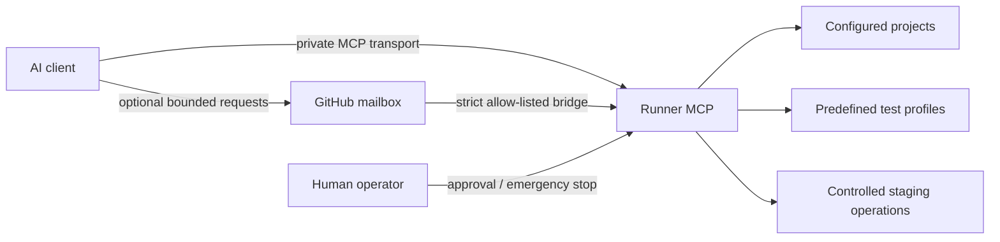

# Runner MCP

_A Fools2Tools project — practical tools from real problems._

Runner MCP is a security-first, self-hosted Model Context Protocol service for controlled development and staging operations.

In one sentence: Runner MCP gives AI clients a narrow, auditable path to self-hosted development and staging work without exposing a general-purpose remote shell.

[Five-minute demo](docs/DEMO.md) · [Quickstart](QUICKSTART.md) · [Security policy](SECURITY.md) · [Threat model](security/THREAT_MODEL.md) · [Roadmap](roadmap/ROADMAP.md)

## Why Runner MCP exists

AI-assisted development becomes much more useful when the assistant can verify changes against real projects. But routine tasks such as reading a safe file, running a known test suite or checking a staging service do not require the authority of a general-purpose remote shell.

Runner MCP turns those routine operations into explicit capabilities. The operator configures projects and named actions locally; the AI client selects from those capabilities instead of supplying arbitrary commands, executable paths or private infrastructure values.

The original motivation was practical: reduce the day-to-day dependency on broad remote-control tooling while keeping useful development and staging automation.

## How it works



Runner MCP is the local safety boundary. GitHub can be used for source collaboration and, optionally, as a bounded mailbox transport; it is not turned into a mechanism for sending arbitrary shell commands.

The normal authority model is deliberately asymmetric: read-only inspection is easier, mutating staging actions are narrower, higher-risk actions require short-lived local approval, and production mutations remain disabled.

## I just want to use it

You do not need to understand the Python source code for the basic workflow.

```bash
git clone https://github.com/Blacksp1d3r/runner-mcp.git
cd runner-mcp
./install.sh
runner-mcp setup
runner-mcp doctor
runner-mcp guide
runner-mcp status
```

Start with [QUICKSTART.md](QUICKSTART.md) for the guided installation.

If Runner MCP runs under a dedicated service account while you log in with a separate operator account, install a local operator wrapper:

```bash
./install-operator.sh SERVICE_USER
runner-mcp guide
```

The wrapper keeps the private configuration with the service account and delegates through `sudo`; it does not copy credentials into the operator account.

For a user-to-developer path, see [docs/USING_AND_EXTENDING.md](docs/USING_AND_EXTENDING.md). Contributors can start with [CONTRIBUTING.md](CONTRIBUTING.md).

For the zero-additional-service-cost GitHub mailbox pattern, see [docs/GITHUB_MAILBOX_BRIDGE.md](docs/GITHUB_MAILBOX_BRIDGE.md). The public package now includes both a transport-neutral processor and a fixed-host GitHub transport; completion feedback and watcher resilience are documented in [docs/COMPLETION_FEEDBACK.md](docs/COMPLETION_FEEDBACK.md) and [docs/WATCHER_RESILIENCE.md](docs/WATCHER_RESILIENCE.md). Bounded multi-project scheduling and capacity controls are documented in [docs/CONCURRENCY.md](docs/CONCURRENCY.md).

Runner MCP is developed as a [Fools2Tools project](docs/FOOLS2TOOLS.md). Public launch readiness is tracked in [docs/LAUNCH_READINESS.md](docs/LAUNCH_READINESS.md). See also the [changelog](CHANGELOG.md), [release checklist](docs/RELEASE_CHECKLIST.md) and prepared [launch copy](docs/LAUNCH_COPY.md).

Useful commands:

```text
runner-mcp setup
runner-mcp doctor
runner-mcp guide
runner-mcp status
runner-mcp emergency-stop on
runner-mcp emergency-stop status
runner-mcp emergency-stop off
runner-mcp project list
runner-mcp project add ...
runner-mcp test-profile list PROJECT
runner-mcp test-profile add PROJECT NAME --preset pytest
runner-mcp service-config list PROJECT
runner-mcp service-config add PROJECT ALIAS --unit UNIT
runner-mcp database-config list
runner-mcp database-config add PROJECT
runner-mcp migration-config add PROJECT --preset alembic
runner-mcp deployment-config list
runner-mcp deployment-config add PROJECT --release-root PATH --service ALIAS
runner-mcp github-mailbox status
runner-mcp github-watcher once
runner-mcp serve
```

The emergency stop is intentionally easy to activate and harder to clear.

## What works today

Current implemented foundations include:

- authenticated MCP over Streamable HTTP;
- project allow-listing;
- safe project file listing, metadata and paged reads;
- path traversal, symlink and secret-file protection;
- request IDs, rate limiting and audit logging;
- DNS-rebinding protection;
- external operator emergency stop;
- rollback-retention policy using both minimum count and minimum age;
- explicit separation between code rollback and database restore;
- controlled asynchronous test jobs;
- bounded fair multi-project test scheduling with per-project opt-in parallelism;
- safe queue, worker and job observability without infrastructure disclosure;
- allow-listed systemd-user staging service status/start/stop/restart;
- optional private service health checks;
- private PostgreSQL backups with safe metadata listing;
- controlled migration status/apply with mandatory pre-migration backup;
- staging-only release planning and asynchronous deployment jobs;
- clean-Git release archives, atomic activation and health-gated rollback;
- safe release history plus one-step asynchronous staging rollback;
- built-in allow-listed project adapters with safe capability inspection;
- strict MCP tool arguments: unknown fields are rejected rather than ignored;
- short-lived human approval gates for migration, deploy and rollback;
- staging-only mutation policy; production remains read-only;
- private ChatGPT connectivity can use OpenAI Secure MCP Tunnel without an inbound public port;
- predefined test profiles only;
- test timeout, cancellation and process-group cleanup;
- scrubbed, bounded test logs;
- recovery of interrupted test-job metadata after restart;
- interactive setup, status and doctor commands;
- CLI project management without manual YAML editing;
- CLI test-profile management with pytest, Ruff and custom presets;
- non-root local installer and guided Quickstart.

## What Runner MCP deliberately does not do

Runner MCP is not intended to provide:

- a general remote shell;
- arbitrary commands supplied by an AI client;
- automatic production database restore;
- any database restore in the current implementation;
- automatic multi-release rollback cascades;
- unrestricted service control;
- untrusted public-fork execution on a privileged persistent runner.

Production actions remain out of scope until stronger approval and isolation controls are implemented.

## Safety model

Runner MCP is built around:

- deny by default;
- explicit project, service and test-profile allow-lists;
- no arbitrary shell as a normal interface;
- no secrets in MCP tool output;
- strict path validation;
- auditable actions;
- least-privilege runtime permissions;
- explicit risk classes for operational tools;
- external operator emergency stop;
- retention confirmation before operator actions;
- one code rollback step per approved action;
- database restore always requiring explicit human approval;
- DNS-rebinding protection tied to the configured MCP resource URL.

See:

- [security/SECURITY_BASELINE.md](security/SECURITY_BASELINE.md)
- [security/THREAT_MODEL.md](security/THREAT_MODEL.md)
- [security/OPERATOR_SAFETY.md](security/OPERATOR_SAFETY.md)
- [security/TEST_EXECUTION.md](security/TEST_EXECUTION.md)

## Public repository rule

This repository must never contain real infrastructure details.

Do not commit:

- real IP addresses or hostnames;
- internal domains;
- private service endpoints or ports;
- usernames;
- absolute deployment paths from a real installation;
- database endpoints;
- credentials or tokens;
- private keys;
- database dumps or backups.

Public examples use placeholders only. Real values belong in private local configuration or an appropriate secret store.

## Controlled test execution

An MCP client may choose only a configured project and named test profile.

A test profile defines the exact executable, exact argument array, project-relative working directory, timeout, log limit and explicitly allowed environment variables.

Commands are launched with `shell=False`.

Running a test still executes project code. Until stronger sandboxing exists, only trusted repository revisions should be tested.

## Rollback philosophy

Code rollback and database recovery are separate operations.

Code releases are retained using both:

- a minimum number of releases;
- a minimum age.

A release is eligible for cleanup only when both conditions permit it.

A single approved rollback action may move back exactly one code release. Runner MCP must stop, health-check and reassess before another rollback.

Database restore is never an automatic side effect of code rollback and always requires explicit human approval.

## Development

Target runtime: Python 3.12+.

Core technologies:

- official MCP Python SDK;
- Pydantic;
- PyYAML;
- Starlette;
- Uvicorn;
- pytest;
- Ruff.

The implementation uses Streamable HTTP for MCP.

Do not connect a privileged persistent self-hosted runner to untrusted public pull-request code.

## Project status

The current implementation state is tracked in:

- [handover/CURRENT_STATE.md](handover/CURRENT_STATE.md)
- [roadmap/ROADMAP.md](roadmap/ROADMAP.md)

Runner MCP is under active development. The public GitHub mailbox stack now includes protocol-v1 validation, replay lifecycle, fixed-host transport, an incremental restart-safe watcher, a loopback-only MCP executor, bounded concurrent request handling, fail-closed missing-result recovery and a private-config runtime/CLI. Shared-watcher migration, exactly-once completion feedback, clean-Linux demo validation and non-root autostart packaging are complete. Built-artifact/release validation and the guided private-connectivity/TLS decision path are now documented and validated; the remaining pre-alpha gate is preparing the exact green release commit/tag and keeping external publication human-controlled.
